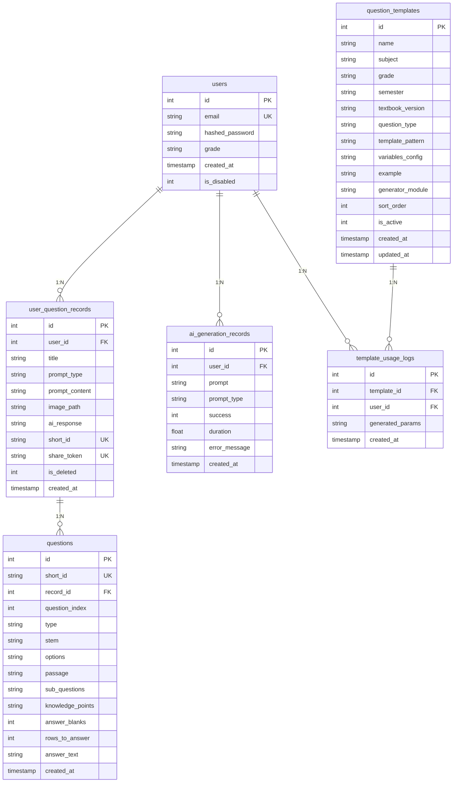
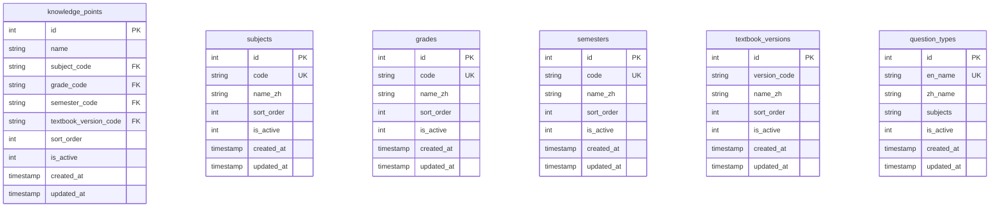
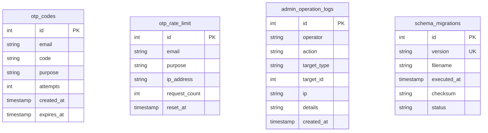

# AI 题库生成器 - 数据库 ER 图

## 数据库概述

- **数据库类型**: SQLite
- **数据库文件**: `database.db` / `question_bank.db`
- **主要用途**: 存储用户账户、题目数据、AI 生成记录、模板配置等

---

## ER 图 (Mermaid)

### 核心业务表关系



---

### 配置表关系



---

### 安全与审计表



---

## 完整 ER 图

```mermaid
erDiagram
    %% 核心业务表
    users ||--o{ user_question_records : "拥有"
    users ||--o{ ai_generation_records : "拥有"
    users ||--o{ template_usage_logs : "使用"
    user_question_records ||--o{ questions : "包含"
    question_templates ||--o{ template_usage_logs : "被使用"

    %% 知识点关联配置表
    subjects ||--|{ knowledge_points : "属于"
    grades ||--|{ knowledge_points : "属于"
    semesters ||--|{ knowledge_points : "属于"
    textbook_versions ||--|{ knowledge_points : "属于"

    %% 用户表
    users {
        int id PK "用户 ID"
        string email UK "邮箱"
        string hashed_password "密码哈希"
        string grade "年级"
        timestamp created_at "创建时间"
        int is_disabled "禁用标记"
    }

    %% 题目相关表
    user_question_records {
        int id PK "记录 ID"
        int user_id FK "用户 ID"
        string title "试卷标题"
        string prompt_type "输入类型"
        string prompt_content "提示词"
        string image_path "图片路径"
        string ai_response "AI 响应"
        string short_id UK "短 ID"
        string share_token UK "分享令牌"
        int is_deleted "软删除"
        timestamp created_at "创建时间"
    }

    questions {
        int id PK "题目 ID"
        string short_id UK "短 ID"
        int record_id FK "试卷 ID"
        int question_index "题目序号"
        string type "题型"
        string stem "题干"
        string options "选项 (JSON)"
        string passage "阅读材料 (JSON)"
        string sub_questions "子题 (JSON)"
        string knowledge_points "知识点 (JSON)"
        int answer_blanks "空格数"
        int rows_to_answer "作答行数"
        string answer_text "答案"
        timestamp created_at "创建时间"
    }

    %% AI 相关表
    ai_generation_records {
        int id PK "记录 ID"
        int user_id FK "用户 ID"
        string prompt "提示词"
        string prompt_type "类型"
        int success "是否成功"
        float duration "耗时 (秒)"
        string error_message "错误信息"
        timestamp created_at "创建时间"
    }

    %% 模板相关表
    question_templates {
        int id PK "模板 ID"
        string name "模板名称"
        string subject "学科"
        string grade "年级"
        string semester "学期"
        string textbook_version "教材版本"
        string question_type "题型"
        string template_pattern "模板模式"
        string variables_config "变量配置 (JSON)"
        string example "示例"
        string generator_module "生成器模块"
        int sort_order "排序"
        int is_active "是否启用"
        timestamp created_at "创建时间"
        timestamp updated_at "更新时间"
    }

    template_usage_logs {
        int id PK "记录 ID"
        int template_id FK "模板 ID"
        int user_id FK "用户 ID"
        string generated_params "参数 (JSON)"
        timestamp created_at "创建时间"
    }

    %% 配置表
    subjects {
        int id PK "学科 ID"
        string code UK "代码"
        string name_zh "中文名"
        int sort_order "排序"
        int is_active "是否启用"
        timestamp created_at "创建时间"
        timestamp updated_at "更新时间"
    }

    grades {
        int id PK "年级 ID"
        string code UK "代码"
        string name_zh "中文名"
        int sort_order "排序"
        int is_active "是否启用"
        timestamp created_at "创建时间"
        timestamp updated_at "更新时间"
    }

    semesters {
        int id PK "学期 ID"
        string code UK "代码"
        string name_zh "中文名"
        int sort_order "排序"
        int is_active "是否启用"
        timestamp created_at "创建时间"
        timestamp updated_at "更新时间"
    }

    textbook_versions {
        int id PK "版本 ID"
        string version_code "代码"
        string name_zh "中文名"
        int sort_order "排序"
        int is_active "是否启用"
        timestamp created_at "创建时间"
        timestamp updated_at "更新时间"
    }

    knowledge_points {
        int id PK "知识点 ID"
        string name "名称"
        string subject_code FK "学科代码"
        string grade_code FK "年级代码"
        string semester_code FK "学期代码"
        string textbook_version_code FK "版本代码"
        int sort_order "排序"
        int is_active "是否启用"
        timestamp created_at "创建时间"
        timestamp updated_at "更新时间"
    }

    question_types {
        int id PK "题型 ID"
        string en_name UK "英文名"
        string zh_name "中文名"
        string subjects "适用学科"
        int is_active "是否启用"
        timestamp created_at "创建时间"
        timestamp updated_at "更新时间"
    }

    %% 安全与审计表
    otp_codes {
        int id PK "记录 ID"
        string email "邮箱"
        string code "验证码"
        string purpose "用途"
        int attempts "尝试次数"
        timestamp created_at "创建时间"
        timestamp expires_at "过期时间"
    }

    otp_rate_limit {
        int id PK "记录 ID"
        string email "邮箱"
        string purpose "用途"
        string ip_address "IP 地址"
        int request_count "请求次数"
        timestamp reset_at "重置时间"
    }

    admin_operation_logs {
        int id PK "日志 ID"
        string operator "操作人"
        string action "操作类型"
        string target_type "对象类型"
        int target_id "对象 ID"
        string ip "IP 地址"
        string details "详情 (JSON)"
        timestamp created_at "创建时间"
    }

    schema_migrations {
        int id PK "迁移 ID"
        string version UK "版本号"
        string filename "文件名"
        timestamp executed_at "执行时间"
        string checksum "校验和"
        string status "状态"
    }
```



---

## 表关系说明

### 核心关系

| 关系 | 类型 | 说明 |
|------|------|------|
| `users` → `user_question_records` | 1:N | 一个用户可以有多条题目记录 |
| `users` → `ai_generation_records` | 1:N | 一个用户可以有多条 AI 生成记录 |
| `users` → `template_usage_logs` | 1:N | 一个用户可以有多条模板使用记录 |
| `user_question_records` → `questions` | 1:N | 一份试卷可以包含多道题目 |
| `question_templates` → `template_usage_logs` | 1:N | 一个模板可以被多次使用 |

### 配置表关系

配置表之间没有外键关联，通过业务逻辑关联：

- `subjects` (学科)、`grades` (年级)、`semesters` (学期)、`textbook_versions` (教材版本)
- `knowledge_points` (知识点) 通过 code 字段与上述配置表关联
- `question_types` (题型) 通过 `subjects` 字段（逗号分隔）关联多个学科

---

## 表详细结构

### 1. users - 用户表

| 字段 | 类型 | 约束 | 说明 |
|------|------|------|------|
| id | INTEGER | PK, AUTOINC | 用户 ID |
| email | TEXT | UNIQUE, NOT NULL | 邮箱（登录标识） |
| hashed_password | TEXT | NOT NULL | bcrypt 密码哈希 |
| grade | TEXT | - | 用户年级 |
| created_at | TIMESTAMP | DEFAULT CURRENT_TIMESTAMP | 创建时间 |
| is_disabled | INTEGER | DEFAULT 0 | 禁用标记 (0=正常，1=禁用) |

**索引**:
- `idx_users_email` - 邮箱查询加速

---

### 2. otp_codes - OTP 验证码表

| 字段 | 类型 | 约束 | 说明 |
|------|------|------|------|
| id | INTEGER | PK, AUTOINC | 记录 ID |
| email | TEXT | NOT NULL | 邮箱 |
| code | TEXT | NOT NULL | 6 位验证码 |
| purpose | TEXT | NOT NULL, DEFAULT 'register' | 用途 (register/reset_password) |
| attempts | INTEGER | DEFAULT 0 | 验证尝试次数 |
| created_at | TIMESTAMP | DEFAULT CURRENT_TIMESTAMP | 创建时间 |
| expires_at | TIMESTAMP | NOT NULL | 过期时间 |

**索引**:
- `idx_otp_codes_email` - 邮箱 + 用途组合查询

---

### 3. otp_rate_limit - OTP 限流表

| 字段 | 类型 | 约束 | 说明 |
|------|------|------|------|
| id | INTEGER | PK, AUTOINC | 记录 ID |
| email | TEXT | NOT NULL | 邮箱 |
| purpose | TEXT | NOT NULL, DEFAULT 'register' | 用途 |
| ip_address | TEXT | - | IP 地址 |
| request_count | INTEGER | DEFAULT 1 | 请求次数 |
| reset_at | TIMESTAMP | NOT NULL | 重置时间 |

**索引**:
- `idx_otp_rate_limit_email` - 邮箱 + 用途组合查询

---

### 4. user_question_records - 用户题目记录表 (试卷表)

| 字段 | 类型 | 约束 | 说明 |
|------|------|------|------|
| id | INTEGER | PK, AUTOINC | 记录 ID |
| user_id | INTEGER | NOT NULL | 用户 ID (FK → users.id) |
| title | VARCHAR(200) | NOT NULL | 试卷标题 |
| prompt_type | VARCHAR(10) | NOT NULL | 输入类型 (text/image) |
| prompt_content | TEXT | NOT NULL | 用户提示词 |
| image_path | VARCHAR(500) | - | 图片路径 |
| ai_response | TEXT | NOT NULL | AI 响应 (Markdown) |
| short_id | TEXT | UNIQUE | 短 ID (分享链接用) |
| share_token | VARCHAR(64) | UNIQUE | 分享令牌 |
| is_deleted | INTEGER | DEFAULT 0 | 软删除标记 |
| created_at | TIMESTAMP | DEFAULT CURRENT_TIMESTAMP | 创建时间 |

**索引**:
- `idx_user_question_records_user_deleted` - 用户记录列表查询
- `idx_user_question_records_share_token` - 分享链接访问
- `idx_user_question_records_short_id` - 短 ID 快速访问

---

### 5. ai_generation_records - AI 生成记录表

| 字段 | 类型 | 约束 | 说明 |
|------|------|------|------|
| id | INTEGER | PK, AUTOINC | 记录 ID |
| user_id | INTEGER | NOT NULL | 用户 ID (FK → users.id) |
| prompt | TEXT | NOT NULL | 原始提示词 |
| prompt_type | VARCHAR(20) | NOT NULL | 提示词类型 |
| success | INTEGER | NOT NULL | 是否成功 (1=成功，0=失败) |
| duration | REAL | NOT NULL | 耗时 (秒) |
| error_message | TEXT | - | 错误信息 |
| created_at | TIMESTAMP | DEFAULT CURRENT_TIMESTAMP | 创建时间 |

**索引**:
- `idx_ai_generation_records_user_id` - 用户记录筛选
- `idx_ai_generation_records_success` - 成功/失败统计
- `idx_ai_generation_records_prompt_type` - 类型筛选
- `idx_ai_generation_records_created_at` - 时间排序
- `idx_ai_generation_records_composite` - 复合查询优化

---

### 6. questions - 题目表

| 字段 | 类型 | 约束 | 说明 |
|------|------|------|------|
| id | INTEGER | PK, AUTOINC | 题目 ID |
| short_id | TEXT | UNIQUE | 短 ID |
| record_id | INTEGER | NOT NULL | 试卷 ID (FK → user_question_records.id) |
| question_index | INTEGER | NOT NULL | 题目序号 (1, 2, 3...) |
| type | TEXT | NOT NULL | 题型 (SINGLE_CHOICE 等) |
| stem | TEXT | NOT NULL | 题干 |
| options | TEXT | - | 选项数组 (JSON) |
| passage | TEXT | - | 阅读材料 (JSON) |
| sub_questions | TEXT | - | 子题列表 (JSON) |
| knowledge_points | TEXT | NOT NULL | 知识点列表 (JSON) |
| answer_blanks | INTEGER | - | 填空题空格数 |
| rows_to_answer | INTEGER | - | 预留作答行数 |
| answer_text | TEXT | - | 标准答案 |
| created_at | TIMESTAMP | DEFAULT CURRENT_TIMESTAMP | 创建时间 |

**索引**:
- `idx_questions_record_id` - 按试卷 ID 和序号查询
- `idx_questions_short_id` - 短 ID 快速访问

---

### 7. admin_operation_logs - 管理员操作日志表

| 字段 | 类型 | 约束 | 说明 |
|------|------|------|------|
| id | INTEGER | PK, AUTOINC | 日志 ID |
| operator | TEXT | NOT NULL | 操作人标识 |
| action | TEXT | NOT NULL | 操作类型 |
| target_type | TEXT | - | 对象类型 |
| target_id | INTEGER | - | 对象 ID |
| ip | TEXT | - | 操作来源 IP |
| details | TEXT | - | 详细信息 (JSON) |
| created_at | TIMESTAMP | DEFAULT CURRENT_TIMESTAMP | 创建时间 |

**索引**:
- `idx_admin_logs_action` - 按操作类型查询
- `idx_admin_logs_target` - 按操作对象查询

---

### 8. question_templates - 题目模板表

| 字段 | 类型 | 约束 | 说明 |
|------|------|------|------|
| id | INTEGER | PK, AUTOINC | 模板 ID |
| name | TEXT | NOT NULL | 模板名称 |
| subject | TEXT | NOT NULL | 学科代码 |
| grade | TEXT | NOT NULL | 年级代码 |
| semester | TEXT | NOT NULL | 学期代码 |
| textbook_version | TEXT | NOT NULL | 教材版本代码 |
| question_type | TEXT | NOT NULL | 题型 |
| template_pattern | TEXT | NOT NULL | 模板模式字符串 |
| variables_config | TEXT | NOT NULL | 变量配置 (JSON) |
| example | TEXT | - | 示例题目 |
| generator_module | TEXT | - | 生成器模块名 |
| sort_order | INTEGER | DEFAULT 0 | 排序序号 |
| is_active | INTEGER | DEFAULT 1 | 是否启用 |
| created_at | TIMESTAMP | DEFAULT CURRENT_TIMESTAMP | 创建时间 |
| updated_at | TIMESTAMP | DEFAULT CURRENT_TIMESTAMP | 更新时间 |

---

### 9. template_usage_logs - 模板使用记录表

| 字段 | 类型 | 约束 | 说明 |
|------|------|------|------|
| id | INTEGER | PK, AUTOINC | 使用记录 ID |
| template_id | INTEGER | NOT NULL | 模板 ID (FK → question_templates.id) |
| user_id | INTEGER | NOT NULL | 用户 ID (FK → users.id) |
| generated_params | TEXT | - | 生成参数 (JSON) |
| created_at | TIMESTAMP | DEFAULT CURRENT_TIMESTAMP | 创建时间 |

---

### 10. subjects - 学科配置表

| 字段 | 类型 | 约束 | 说明 |
|------|------|------|------|
| id | INTEGER | PK, AUTOINC | 学科 ID |
| code | TEXT | UNIQUE, NOT NULL | 学科代码 (math/chinese/english) |
| name_zh | TEXT | NOT NULL | 中文名 (数学/语文/英语) |
| sort_order | INTEGER | DEFAULT 0 | 排序序号 |
| is_active | INTEGER | DEFAULT 1 | 是否启用 |
| created_at | TIMESTAMP | DEFAULT CURRENT_TIMESTAMP | 创建时间 |
| updated_at | TIMESTAMP | DEFAULT CURRENT_TIMESTAMP | 更新时间 |

**索引**:
- `idx_subjects_code` - 学科代码查询

---

### 11. grades - 年级配置表

| 字段 | 类型 | 约束 | 说明 |
|------|------|------|------|
| id | INTEGER | PK, AUTOINC | 年级 ID |
| code | TEXT | UNIQUE, NOT NULL | 年级代码 (grade1~grade9) |
| name_zh | TEXT | NOT NULL | 中文名 (一年级~九年级) |
| sort_order | INTEGER | DEFAULT 0 | 排序序号 |
| is_active | INTEGER | DEFAULT 1 | 是否启用 |
| created_at | TIMESTAMP | DEFAULT CURRENT_TIMESTAMP | 创建时间 |
| updated_at | TIMESTAMP | DEFAULT CURRENT_TIMESTAMP | 更新时间 |

**索引**:
- `idx_grades_code` - 年级代码查询

---

### 12. semesters - 学期配置表

| 字段 | 类型 | 约束 | 说明 |
|------|------|------|------|
| id | INTEGER | PK, AUTOINC | 学期 ID |
| code | TEXT | UNIQUE, NOT NULL | 学期代码 (upper/lower) |
| name_zh | TEXT | NOT NULL | 中文名 (上学期/下学期) |
| sort_order | INTEGER | DEFAULT 0 | 排序序号 |
| is_active | INTEGER | DEFAULT 1 | 是否启用 |
| created_at | TIMESTAMP | DEFAULT CURRENT_TIMESTAMP | 创建时间 |
| updated_at | TIMESTAMP | DEFAULT CURRENT_TIMESTAMP | 更新时间 |

**索引**:
- `idx_semesters_code` - 学期代码查询

---

### 13. textbook_versions - 教材版本配置表

| 字段 | 类型 | 约束 | 说明 |
|------|------|------|------|
| id | INTEGER | PK, AUTOINC | 版本 ID |
| version_code | TEXT | NOT NULL | 版本代码 (rjb/bsd/sj 等) |
| name_zh | TEXT | NOT NULL | 中文名 (人教版/北师大版等) |
| sort_order | INTEGER | DEFAULT 0 | 排序序号 |
| is_active | INTEGER | DEFAULT 1 | 是否启用 |
| created_at | TIMESTAMP | DEFAULT CURRENT_TIMESTAMP | 创建时间 |
| updated_at | TIMESTAMP | DEFAULT CURRENT_TIMESTAMP | 更新时间 |

**索引**:
- `idx_textbook_versions_code` - 版本代码查询

---

### 14. knowledge_points - 知识点表

| 字段 | 类型 | 约束 | 说明 |
|------|------|------|------|
| id | INTEGER | PK, AUTOINC | 知识点 ID |
| name | TEXT | NOT NULL | 知识点名称 |
| subject_code | TEXT | NOT NULL | 学科代码 (FK 引用) |
| grade_code | TEXT | NOT NULL | 年级代码 (FK 引用) |
| semester_code | TEXT | NOT NULL | 学期代码 (FK 引用) |
| textbook_version_code | TEXT | NOT NULL | 教材版本代码 (FK 引用) |
| sort_order | INTEGER | DEFAULT 0 | 排序序号 |
| is_active | INTEGER | DEFAULT 1 | 是否启用 |
| created_at | TIMESTAMP | DEFAULT CURRENT_TIMESTAMP | 创建时间 |
| updated_at | TIMESTAMP | DEFAULT CURRENT_TIMESTAMP | 更新时间 |

**索引**:
- `idx_kp_filters` - 多维度筛选组合查询
- `idx_kp_active` - 启用状态 + 名称查询

---

### 15. question_types - 题型表

| 字段 | 类型 | 约束 | 说明 |
|------|------|------|------|
| id | INTEGER | PK, AUTOINC | 题型 ID |
| en_name | TEXT | UNIQUE, NOT NULL | 英文名 (SINGLE_CHOICE 等) |
| zh_name | TEXT | NOT NULL | 中文名 |
| subjects | TEXT | NOT NULL, DEFAULT 'math,chinese,english' | 适用学科 (逗号分隔) |
| is_active | INTEGER | DEFAULT 1 | 是否启用 |
| created_at | TIMESTAMP | DEFAULT CURRENT_TIMESTAMP | 创建时间 |
| updated_at | TIMESTAMP | DEFAULT CURRENT_TIMESTAMP | 更新时间 |

**索引**:
- `idx_question_types_en_name` - 英文名查询

---

### 16. schema_migrations - 数据库迁移记录表

| 字段 | 类型 | 约束 | 说明 |
|------|------|------|------|
| id | INTEGER | PK, AUTOINC | 迁移 ID |
| version | TEXT | UNIQUE, NOT NULL | 迁移版本号 |
| filename | TEXT | NOT NULL | 迁移文件名 |
| executed_at | TIMESTAMP | DEFAULT CURRENT_TIMESTAMP | 执行时间 |
| checksum | TEXT | - | 校验和 |
| status | TEXT | DEFAULT 'success' | 状态 |

**索引**:
- `idx_schema_migrations_version` - 版本号查询

---

## 数据流示例

### 用户生成题目流程

```
1. 用户登录 → users 表验证
2. 用户输入提示词 → 调用 AI API
3. AI 生成记录 → ai_generation_records
4. 生成试卷 → user_question_records
5. 解析题目 → questions (多道题目)
6. 可选：使用模板 → template_usage_logs + question_templates
```

### 分享题目流程

```
1. 试卷关联 share_token → user_question_records
2. 生成公开链接 (使用 short_id)
3. 访问者通过 short_id/share_token 获取试卷和题目
```

### 管理员审计流程

```
1. 管理员操作 → admin_operation_logs 记录
2. 可追溯：操作人、操作类型、操作对象、IP、详情
```

---

## 设计原则

1. **软删除**: 使用 `is_deleted` 标记，保留数据可恢复性
2. **时间戳**: 所有核心表都有 `created_at` / `updated_at` 字段
3. **索引优化**: 为高频查询字段创建索引
4. **配置数据化**: 学科/年级/学期/教材版本等都存储在数据库中，支持动态配置
5. **JSON 存储**: 复杂结构（选项、知识点等）使用 JSON 格式存储

---

## 版本历史

| 版本 | 日期 | 说明 |
|------|------|------|
| 1.0 | 2025-XX-XX | 初始版本，基础表结构 |
| 1.1 | 2025-XX-XX | 添加配置表 (subjects/grades/semesters/textbook_versions) |
| 1.2 | 2025-XX-XX | 添加知识点表、题型表 |
| 1.3 | 2025-XX-XX | 添加迁移记录表 schema_migrations |
